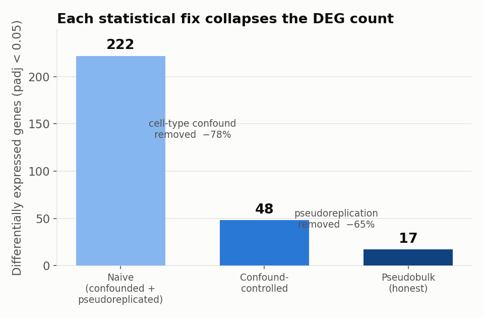
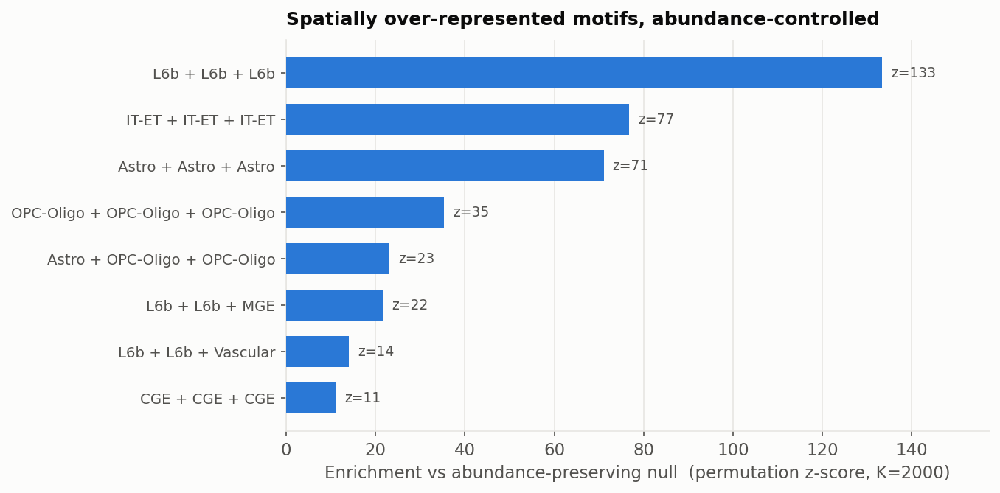
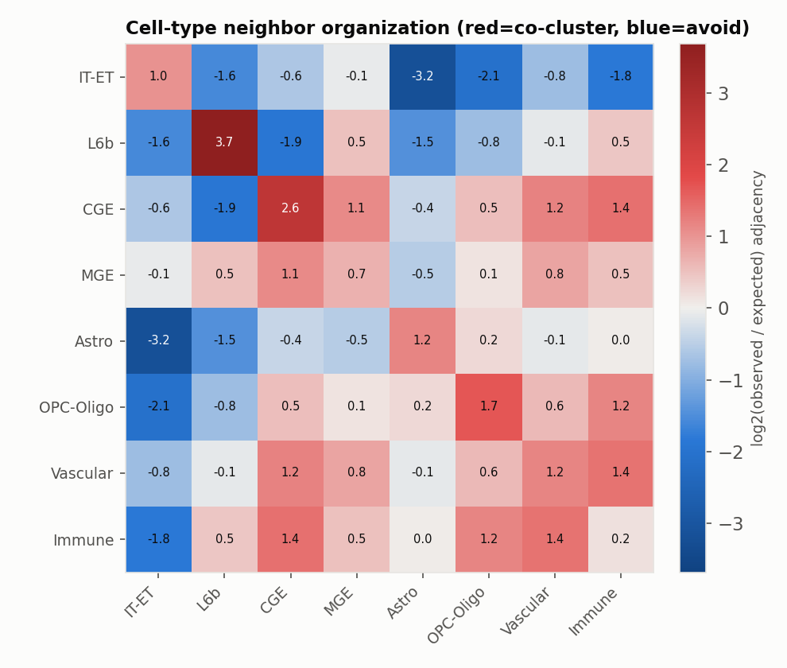

# Results — section .35 cortical crop

Analysis of one contiguous cortical patch (3,968 cells, 8 cell classes) from ABC Atlas mouse-brain
MERFISH (`MERFISH-C57BL6J-638850`, section .35). The story is methodological as much as biological:
**naive spatial analyses overstate almost everything, and correcting for it recovers real, modest,
defensible signal.** Full assumptions and caveats: [`docs/LIMITATIONS.md`](docs/LIMITATIONS.md).

---

## 1. Naive spatial DE is severely inflated

Differential expression for the OPC-Oligo motif (in-motif vs out-of-motif cells), run three ways.
Each methodological fix removes a large block of "significant" genes:

- **Naive** (motif cells vs all others, per-cell) — 222 DEGs. Confounded by cell type *and*
  pseudoreplicated (thousands of correlated cells treated as independent).
- **Confound-controlled** (same cell type, in vs out of motif) — 48 DEGs. Removing cell-type
  confounding drops **78%** of the naive hits.
- **Pseudobulk** (cells aggregated into spatial-tile replicates, `~tile + group`) — **17 DEGs**.
  Fixing pseudoreplication removes a further **65%**.

**222 → 17.** Most of what a naive pipeline would report as motif biology is statistical artifact.

## 2. TrimNN ranks by abundance; a permutation null recovers real enrichment

TrimNN's `specific_size` output ranks motifs by raw occurrence, so its top "overrepresented" motif
is just the most abundant cell types together (`Astro + Glut + Glut`). An independent
**permutation null** (shuffle cell-type labels on the fixed graph, K=2000) controls for abundance
and inverts the ranking to real spatial structure — **layer-6b neuron clustering dominates (z=133)**,
followed by astrocyte and oligodendrocyte-lineage clustering.

> **Caveat kept honest:** with ~7,900 triangles the test is so powerful that 107/108 motifs are
> "significant" — so we rank by **effect size (z)**, not p-value. And TrimNN's neural occurrence
> prediction correlates only **r = 0.52** with exact triangle counts.

## 3. The cortical neighbor map: same-type clustering, neuron↔glia exclusion

Log₂(observed / expected) cell-type adjacency (red = neighbors more than chance, blue = less).
The diagonal is red — **cells cluster with their own type** (L6b +3.7, CGE +2.6, OPC +1.7). The
strongest off-diagonal signal is deep blue: **excitatory neurons avoid glia as neighbors**
(`IT-ET × Astro = −3.2`, `IT-ET × OPC = −2.1`). Global cell-type spatial organization: Cramér's V = 0.28.

## Cross-validation & the communication null

- **Two methods agree:** TrimNN's greedy `all_size` search independently grew its size-4 motifs from
  the `Immune³` (microglia) motif — the same motif our permutation null flags as most over-represented
  by ratio. From-scratch statistics and the tool's internal logic converge on the same biology.
- **Cell-cell communication** (squidpy `ligrec`): **0 of 65** candidate ligand-receptor pairs were
  even testable — the 550-gene MERFISH panel is a cell-type marker set, not a signaling-pair set. An
  honest null that quantifies why the panel bounds every expression-based conclusion.

**Bottom line:** motifs are the headline; DE, enrichment, and communication are honest, panel-limited
support. The value of this repo is showing the difference between the inflated naive answer and the
defensible one.
